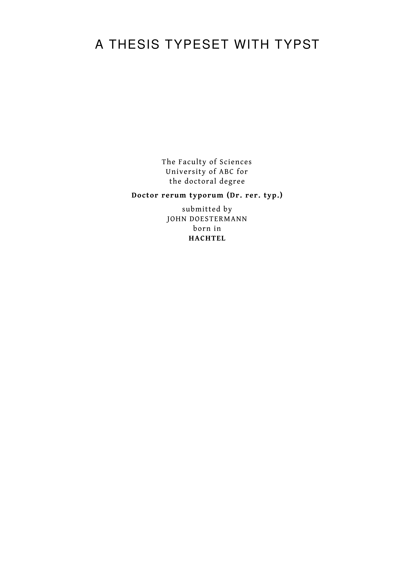
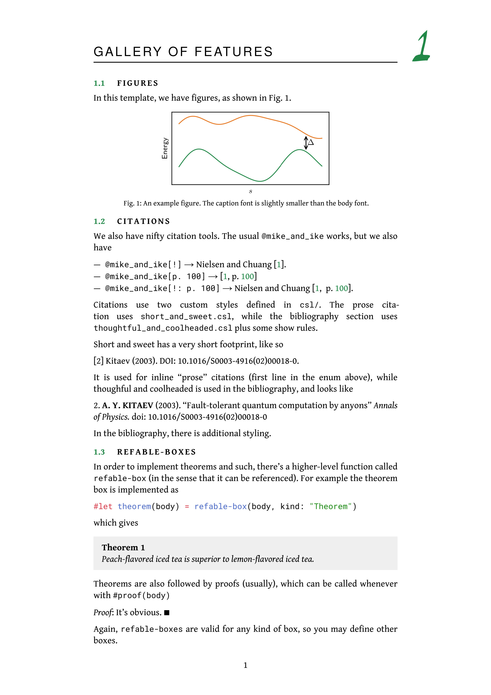
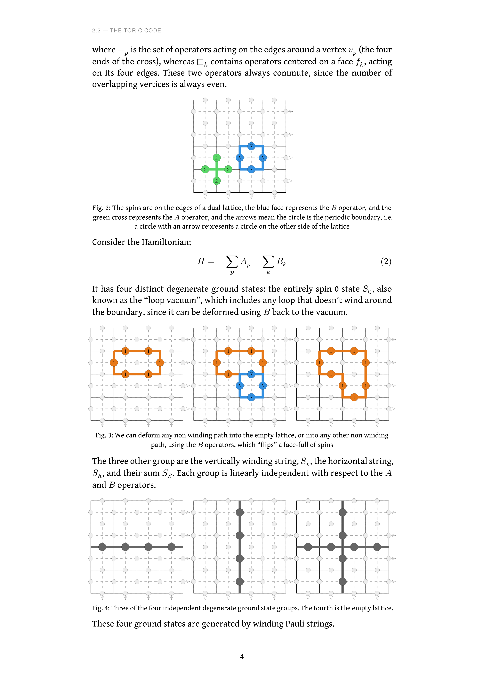
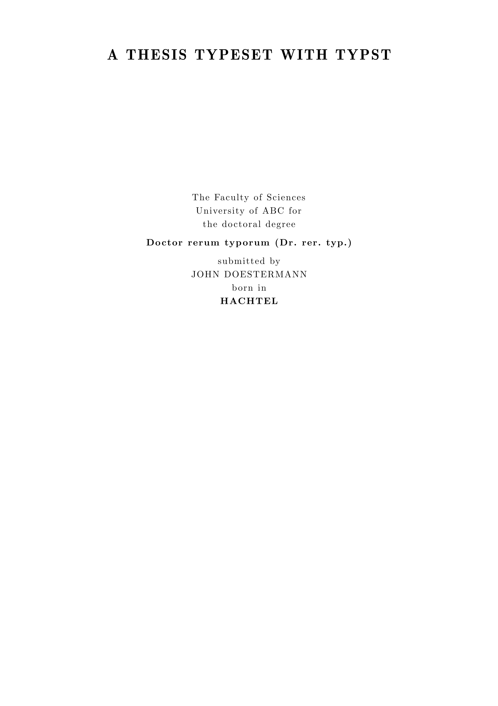
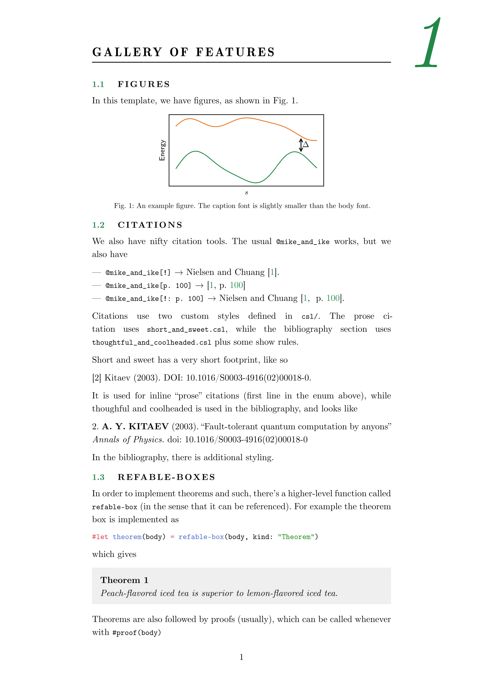
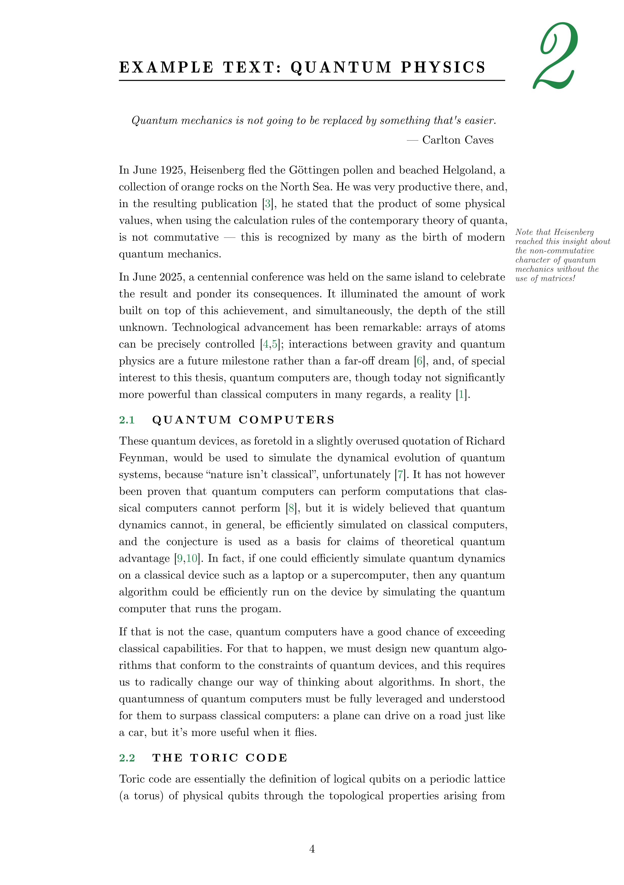
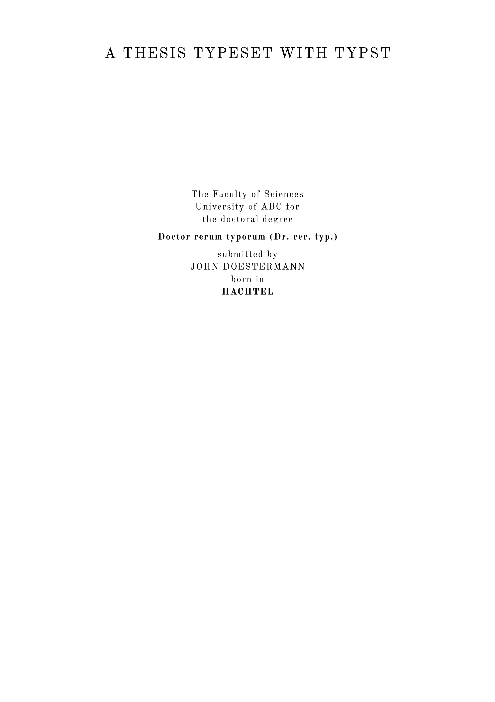
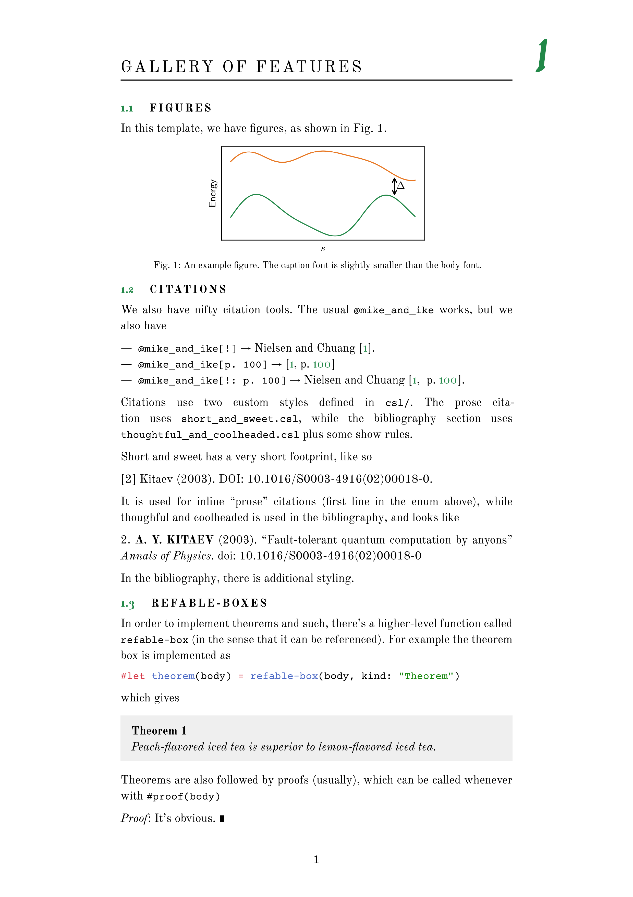
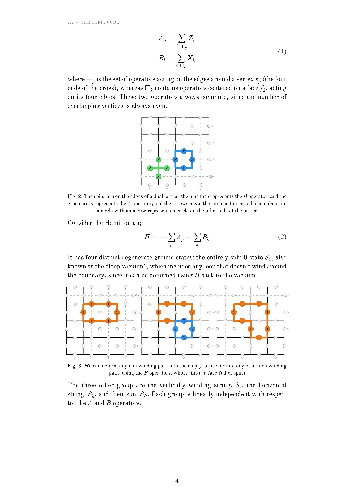

# Typst PhD Thesis Template

A PhD thesis template for [Typst](https://typst.app) inspired by the LaTeX `ClassicThesis` package. The placeholder content (rendered in `pdf/`) contains a demo of the main features.

## Compiling

```
typst compile main.typ pdf/default_style.pdf --font-path=./fonts
```

`compile.sh` builds three font style variants (default, 1920ish-looking, LaTeX-style). Required fonts are in `fonts/` so no system font install is needed.

## Some features

**Citations.** Two citation styles, defined in `csl/` and swapped by context:
- `short-and-sweet.csl` for inline prose citations
- `thoughtful-and-coolheaded.csl` for the bibliography, with extra show-rule styling

Custom show rules on top of `@key`:
- `@key[!]` renders a compact "prose" form
- `@key[p. 100]` adds a page reference
- `@key[!: p. 100]` combines both

You may need to download my [custom citation styles](https://github.com/lmarti-dev/citation_styles) for it to work.

**Refable boxes.** A `refable-box` function underlies numbered, referenceable environments. `theorem`, `proposition`, and `postulate` are built on it, each auto-numbered and citable like a figure.

**Acronyms.** List full-expression/acronym pairs in the `acrodict` array in `utils/inputs.typ`. The template finds the first occurrence of each full expression in the text, appends the acronym in parentheses, and replaces every later mention with a linked acronym pointing to a table in the back matter. Set `debug: true` in `inputs.typ` to highlight matches during editing.

**Margin notes.** `margin-note[...]` places italicized text in the right margin. It forces a line break, so place it at the end of a paragraph.

**Print mode.** Setting `printable: true` in `inputs.typ` breaks new chapters to odd pages and switches to inside/outside margins for double-sided printing. `draft: true` stamps a red "DRAFT" watermark on every page.

## Customizing

The file `utils/inputs.typ` contains most of the styling options. 


## TODO

- Remove page header if the page starts with a title header. 
- Add customization options for chapter numbering
- Better margin note behaviour


## Gallery

### Default style

<div style:"display:flex">



</div>

### LaTeX style

<div style:"display:flex">



</div>

### Old-school style

<div style:"display:flex">



</div>